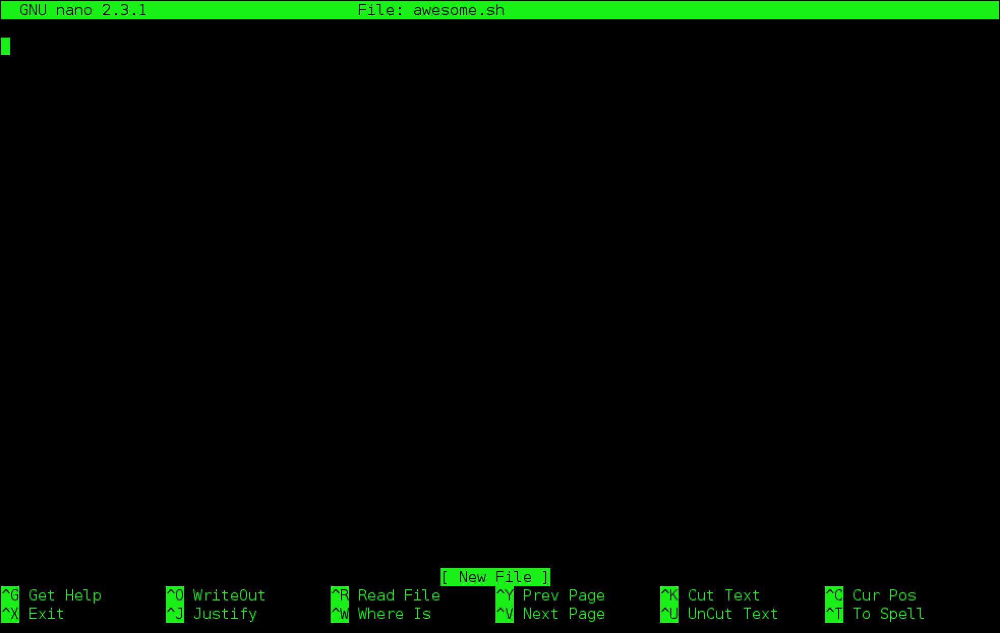

===========================
Introductory Unix Shell
===========================

Updated June 2018 by Ulas Karaoz

Credits
----------
Original author: Tracy Teal for Data Carpentry (http://datacarpentry.org).

Original contributors:
Paul Wilson, Milad Fatenejad, Sasha Wood and Radhika Khetani for
Software Carpentry (http://software-carpentry.org/)

Additional contributors:
Titus Brown, Karen Word (https://github.com/ngs-docs/2015-shell-genomics/blob/gh-pages/README.rst)

Objectives
----------

- What is the shell?
- How do you access it?
- How do you use it and what is it good for?

  * Running commands
  * Storing files in folders
  * Manipulating files
  * Automating actions

- Where are resources where I can learn more?

Notes
-----

This workshop operates under the Software Carpentry Code of conduct:
http://software-carpentry.org/conduct/

What is the shell?
------------------

The *shell* is a program that presents a command line interface
which allows you to control your computer using commands entered
with a keyboard instead of controlling graphical user interfaces
(GUIs) with a mouse/keyboard combination.

Some specific reasons to learn about the shell:

* For most bioinformatics tools, you have to use the shell. There is no
  graphical interface. If you want to work in metagenomics or genomics you're
  going to need to use the shell.

* The shell gives you *power*. The command line gives you the power to
  do your work more efficiently and more quickly.  When you need to do
  things tens to hundreds of times, knowing how to use the shell is
  transformative.

* To use remote computers or cloud computing, you need to use the shell.

Information on the shell
------------------------

The challenge with UNIX is that it's not particularly simple - it's a
power tool, with its own deep internal logic with lots of details.
The joke is that Unix is user-friendly - it's just very selective
about who its friends are!

shell cheat sheets:

* http://fosswire.com/post/2007/08/unixlinux-command-cheat-sheet/
* https://github.com/swcarpentry/boot-camps/blob/master/shell/shell_cheatsheet.md

Explain shell - a web site where you can see what the different
components of a shell command are doing.

* http://explainshell.com
* http://www.commandlinefu.com

(We'll look at these at the bottom.)

Starting with the shell
-----------------------

We will spend most of our time learning about the basics of the shell
by manipulating some experimental data.

Now we're going to download the data for the tutorial. For this you'll need
internet access, because you're going to get it off the web.

Open up the shell and type the command::

   pwd

and then hit ENTER - this will give you a directory name. Remember it!

We next want to use our Web browser to download the file:

   https://s3-us-west-1.amazonaws.com/dib-training.ucdavis.edu/shell-data.zip

to our computer, and then use the file browser to copy it to the directory shown by ``pwd`` above.
Now, then unpack it in that directory (probably by double clicking on it).

Once that's done, type::

   ls

and hit ENTER.  You should see a listing of files, with 'shell-data.zip' and
'data' among them.

Once you see that, put up your green stickies.  If you don't know where to
start, put up your pink sticky.

Running commands
----------------

'pwd' and 'ls' are examples of commands - programs you run at the shell
prompt that do stuff. pwd stands for 'print working directory', while
'ls' stands for 'list files'.

Another command you'll find yourself using a lot is 'cd', which stands
for 'change directory'.  Try typing::

   cd data

and then::

   pwd

You should see that you're now in the data/ subdirectory (or folder)
underneath the original directory. Type 'ls' to see what files are in
here.

What's going on?

The shell has a concept of "working directory", which is basically the
default location for commands to look when you run them.  When you run
'ls', by default it looks in your current working directory; when you
run 'cd', it changes your current working directory.

What's the difference between 'cd' and 'data'? Here, 'cd' is the command,
and 'data' is an *argument* to that command - think of the command as the
verb, and the argument as the noun upon which the verb acts.

Now type::

  cd ..

and type 'ls'.  You should see at least two entries,
``shell-data.zip`` and ``data``.  Here you're using shorthand notation
to go back up a directory.

Type::

  ls data

to tell ls to look in a different directory than your current working
directory.  This is equivalent to::

  cd data
  ls
  cd ..

Files and directories
~~~~~~~~~~~~~~~~~~~~~

Go back into the 'data' directory and list the files::

   cd data
   ls

In here, all mixed up together are files and directories/folders. If
we want to know which is which, we can type::

    ls -F

Anything with a "/" after it is a directory.  Things with a "*" after
them are programs.  It there's nothing there it's an otherwise
unremarkable file (e.g. a data file).

You can also use the command::

    ls -l

to see whether items in a directory are files or directories. `ls -l`
gives a lot more information too, such as the size of the file.

Command line options
~~~~~~~~~~~~~~~~~~~~

Most programs take additional options (or "arguments") that control
their exact behavior. For example, `-F` and `-l` are arguments to
`ls`.  The `ls` program, like many programs, take a lot of
arguments. But how do we know what the options are to particular
commands?

Most commonly used shell programs have a manual. You can access the
manual using the `man` program. Try entering::

    man ls

This will open the manual page for ``ls``. Use the space key to go
forward and b to go backwards. When you are done reading, hit ``q``
to quit.

Programs that are run from the shell can get extremely complicated. To
see an example, open up the manual page for the ``find`` program.  No
one can possibly learn all of these arguments, of course. So you will
probably find yourself referring back to the manual page frequently.

The Unix directory file structure
------------------------------------------------------

As you've already just seen, you can move around in different directories
or folders at the command line. Why would you want to do this, rather
than just navigating around the normal way.

When you're working with bioinformatics programs, you're working with
your data and it's key to be able to have that data in the right place
and make sure the program has access to the data. Many of the problems
people run in to with command line bioinformatics programs is not having the
data in the place the program expects it to be.

Moving around the file system
~~~~~~~~~~~~~~~~~~~~~~~~~~~~~

Let's practice moving around a bit.

We're going to work in that ``data`` directory we just downloaded.

First let's navigate there using the regular way by clicking on the
different folders.

First we did something like go to the folder of our username. Then we opened
'data'

This is called a hierarchical file system structure, like an upside down tree
with root (/) at the base that looks like this.

.. image:: img/unix-tree.jpg

That (/) at the base is often also called the 'top' level.

When you are working at your computer or log in to a remote computer,
you are on one of the branches of that tree, your home directory
(/home/mtb_upm)

Now let's go do that same navigation at the command line.

Type::

    cd

This puts you in your home directory. This folder here.

Now using ``cd`` and ``ls``, go in to the 'data' directory and list its
contents.

Let's also check to see where we are. Sometimes when we're wandering
around in the file system, it's easy to lose track of where we are and
get lost.

Again, if you want to know what directory you're currently in, type::

    pwd

What if we want to move back up and out of the 'data' directory? Can we just
type ``cd home``? Try it and see what happens.

To go 'back up a level' we need to use ``..``.

Type::

    cd ..

Now do ``ls`` and ``pwd``. See now that we went back up in to the home
directory. ``..`` means go back up to the enclosing folder level.

Looking within folders within folder within...
~~~~~~~~~~~~~~~~~~~~~~~~~~~~~~~~~~~~~~~~~~~~~~

Try entering::

    cd data/hidden

and you will jump directly to ``hidden`` without having to go through
the intermediate directory.  Here, we're telling cd to go into 'data'
first, and then 'hidden'.

Then do::

    cd ../..

to go back up two levels.  (Try typing ``pwd`` to see where you are!)

You could put more directories and a file
on the end, too; for example, ::

    ls data/hidden/tmp1/notit.txt

You can do the same thing with any UNIX command that takes a file or
directory name.

Shortcut: Tab Completion
~~~~~~~~~~~~~~~~~~~~~~~~

Navigate to the home directory. Typing out directory names can waste a
lot of time. When you start typing out the name of a directory, then
hit the tab key, the shell will try to fill in the rest of the
directory name. For example, type ``cd`` to get back to your home directy, then enter::

    cd da<tab>

The shell will fill in the rest of the directory name for
'data'. Now cd to data/IlluminaReads and try::

    ls S1<tab><tab>

When you hit the first tab, nothing happens. The reason is that there
are multiple directories in the home directory which start with
``S1``. Thus, the shell does not know which one to fill in. When you hit
tab again, the shell will list the possible choices.

Tab completion can also fill in the names of programs. For example,
enter ``e<tab><tab>``. You will see the name of every program that
starts with an ``e``. One of those is ``echo``. If you enter ``ec<tab>`` you
will see that tab completion works.

Full vs. Relative Paths
-----------------------

The ``cd`` command takes an argument which is the directory
name. Directories can be specified using either a *relative* path or a
full *path*. The directories on the computer are arranged into a
hierarchy. The full path tells you where a directory is in that
hierarchy. Navigate to the home directory. Now, enter the ``pwd``
command and you should see::

    /home/mtb_upm

which is the full name of your home directory. This tells you that you
are in a directory called ``mtb_upm``, which sits inside a directory called
``home`` which sits inside the very top directory in the hierarchy. The
very top of the hierarchy is a directory called ``/`` which is usually
referred to as the *root directory*. So, to summarize: ``mtb_upm`` is a
directory in ``home`` which is a directory in ``/``.

Now enter the following command::

    cd /home/mtb_upm/data/hidden

This jumps to ``hidden``. Now go back to the home directory (cd). We saw
earlier that the command::

    cd data/hidden

had the same effect - it took us to the ``hidden`` directory. But,
instead of specifying the full path
(``/home/mtb_upm/data``), we specified a *relative path*. In
other words, we specified the path relative to our current
directory. A full path always starts with a ``/``. A relative path does
not.

A relative path is like getting directions from someone on the
street. They tell you to "go right at the Stop sign, and then turn
left on Main Street". That works great if you're standing there
together, but not so well if you're trying to tell someone how to get
there from another country. A full path is like GPS coordinates.  It
tells you exactly where something is no matter where you are right
now.

You can usually use either a full path or a relative path depending on
what is most convenient. If we are in the home directory, it is more
convenient to just enter the relative path since it involves less
typing.

Over time, it will become easier for you to keep a mental note of the
structure of the directories that you are using and how to quickly
navigate amongst them.

Saving time with shortcuts, wild cards, and tab completion
----------------------------------------------------------

Shortcuts
~~~~~~~~~

There are some shortcuts which you should know about. Dealing with the
home directory is very common. So, in the shell the tilde character,
""~"", is a shortcut for your home directory. Navigate to the ``data``
directory::

    cd
    cd data

Then enter the command::

    ls ~

This prints the contents of your home directory, without you having to
type the full path. The shortcut ``..`` always refers to the directory
above your current directory. Thus::

    ls ..

prints the contents of the /home/mtb_upm directory. You can chain
these together, so::

    ls ../../

prints the contents of ``/home' which is above your home
directory. Finally, the special directory ``.`` always refers to your
current directory. So, ``ls``, ``ls .``, and ``ls ././././.`` all do the
same thing, they print the contents of the current directory. This may
seem like a useless shortcut right now, but we'll see when it is
needed in a little while.

To summarize, while you are in the ``shell`` directory, the commands
``ls ~``, ``ls ~/.``, ``ls ../../``, and ``ls /home/mtb_upm`` all do
exactly the same thing. These shortcuts are not necessary, they are
provided for your convenience.

A data set: FASTQ files
-----------------------

We whole-genome sequenced 9 bacterial genomes and generated paired-end Illumina reads.
We get our data back from the sequencing center as FASTQ files, and we
stick them all in a folder called IlluminaReads.

We want to be able to look at these files and do some things with
them.

Wild cards
~~~~~~~~~~

Navigate to the ``data/IlluminaReads`` directory (hint: use ``cd``). This
directory contains our FASTQ files and some other ones we'll need for
analyses. If we type ``ls``, we will see that there are a bunch of
files with long file names.  Some of them end with .fastq.

The ``*`` character is a shortcut for "everything". Thus, if you enter
``ls *``, you will see all of the contents of a given directory. Now try
this command::

    ls *fastq

This lists every file that ends with a ``fastq``. This command::

    ls /usr/bin/*.sh

Lists every file in ``/usr/bin`` that ends in the characters ``.sh``.

We have paired end sequencing, so for every sample we have two
files. If we want to just see the list of the files for the forward
direction sequencing we can use::

    ls *R1*fastq

lists every file in the current directory whose name contains the
number ``R1``, and ends with ``fastq``. There are 18 such files which
we would expect because we have 9 samples.

So how does this actually work? Well...when the shell (bash) sees a
word that contains the ``*`` character, it automatically looks for
filenames that match the given pattern. In this case, it identified
four such files. Then, it replaced the ``*R1*fastq`` with the list of
files, separated by spaces.

What happens if you do ``ls R1*fastq``?

When wildcards go bad
----------------------

TODO: explain how to deal with filenames that being with '-' (use '--'),
have spaces (use quotes/backslashes/tab completion), and/or quotes
(use the other kind of quotes/backslashes/tab completion).

Examining Files
---------------

We now know how to switch directories, run programs, and look at the
contents of directories, but how do we look at the contents of files?

The easiest way to examine a file is to just print out all of the
contents using the program ``cat``. Enter the following command::

    cat S190_L001_R1_001.fastq

This prints out the contents of the ``S190_L001_R1_001.fastq`` file.

1.  Print out the contents of the ``~/data/IlluminaReads/upm.files``
    file. What does this file contain?

2.  Without changing directories, (you should still be in ``data``),
    use one short command to print the contents of all of the files in
    the ``/home/mtb_upm/data/IlluminaReads`` directory.

-----

Make sure we're in the right place for the next set of the lessons. We
want to be in the ``IlluminaReads`` directory. Check if you're there with ``pwd``
and if not navigate there. One way to do that would be ::

    cd ~/data/IlluminaReads

-----

``cat`` is a terrific program, but when the file is really big, it can
be annoying to use. The program, ``less``, is useful for this
case. Enter the following command::

    less S188_L001_R1_001.fastq

``less`` opens the file, and lets you navigate through it. The commands
are identical to the ``man`` program.

**Some commands in ``less``**

| key     | action |
| ------- | ---------- |
| "space" | to go forward |
|  "b"    | to go backwards |
|  "g"    | to go to the beginning |
|  "G"    | to go to the end |
|  "q"    | to quit |

``less`` also gives you a way of searching through files. Just hit the
"/" key to begin a search. Enter the name of the word you would like
to search for and hit enter. It will jump to the next location where
that word is found. Try searching the ``S188_L001_R1_001.fastq`` file for 
"TACGGAGGATGC". If you hit "/" then "enter", ``less`` will just repeat
the previous search. ``less`` searches from the current location and
works its way forward. If you are at the end of the file and search
for the word "cat", ``less`` will not find it. You need to go to the
beginning of the file and search.

For instance, let's search for the sequence ``1101:9376:4054`` in our file.
You can see that we go right to that sequence and can see
what it looks like.

Remember, the ``man`` program actually uses ``less`` internally and
therefore uses the same commands, so you can search documentation
using "/" as well.

There's another way that we can look at files, and in this case, just
look at part of them. This can be particularly useful if we just want
to see the beginning or end of the file, or see how it's formatted.

The commands are ``head`` and ``tail`` and they just let you look at
the beginning and end of a file respectively. ::

   head S188_L001_R1_001.fastq
   tail S188_L001_R1_001.fastq

The ``-n`` option to either of these commands can be used to print the
first or last ``n`` lines of a file. To print the first/last line of the
file use::

   head -n 1 S188_L001_R1_001.fastq
   tail -n 1 S188_L001_R1_001.fastq

Searching files
---------------

We showed a little how to search within a file using ``less``. We can also
search within files without even opening them, using ``grep``. Grep is a command-line
utility for searching plain-text data sets for lines matching a string or regular expression.
Let's give it a try.

Let's search for that sequence ``1101:9376:4054`` in the S188_L001_R1_001.fastq file. ::

    grep 1101:9376:4054 S188_L001_R1_001.fastq

We get back the whole line that had '1101:14341' in it. What if we wanted all
four lines, the whole part of that FASTQ sequence, back instead. ::

    grep -A 3 1101:9376:4054 S188_L001_R1_001.fastq

The ``-A`` flag stands for "after match" so it's returning the line that
matches plus the three after it. The ``-B`` flag returns that number of lines
before the match.

Creating, moving, copying, and removing
---------------------------------------

Now we can move around in the file structure and look at files. But
what if we want to do normal things like copy files or move them
around or get rid of them. Sure we could do most of these things
without the command line, but what fun would that be?! Besides it's
often faster to do it at the command line, or you'll be on a remote
server where you won't have another option.

The upm.files file is one that tells us what sample name
goes with what sequences. This is a really important file, so
we want to make a copy so we don't lose it.

Lets copy the file using the ``cp`` command. The ``cp``
command backs up the file. Navigate to the ``IlluminaReads`` directory and enter::

    cp upm.files upm.files_backup

Now ``upm.files_backup`` has been created as a copy of ``upm.files``.

Let's make a ``backup`` directory where we can put this file.

The ``mkdir`` command is used to make a directory. Just enter ``mkdir``
followed by a space, then the directory name. ::

    mkdir backup

We can now move our backed up file in to this directory. We can
move files around using the command ``mv``. Enter this command::

    mv upm.files_backup backup/

This moves ``upm.files_backup`` into the directory ``backup/``;
the full path would be ``~/data/IlluminaReads/backup``.

The ``mv`` command is also how you rename files. Since this file is so
important, let's rename it::

    mv upm.files upm.files_IMPORTANT

Now the file name has been changed to upm.files_IMPORTANT. Let's delete
the backup file now::

    rm backup/upm.files_backup

The ``rm`` file removes the file. Be careful with this command. It doesn't
just nicely put the files in the Trash. **They're really gone**.

By default, ``rm``, will NOT delete directories. You can tell ``rm`` to
delete a directory using the ``-r`` option; we could test it out on
backup, but let's not... ;)

Writing files
-------------

We've been able to do a lot of work with files that already exist, but what
if we want to write our own files. Obviously, we're not going to type in
a FASTQ file, but you'll see as we go through other tutorials, there are
a lot of reasons we'll want to write a file, or edit an existing file.

To write in files, we're going to use the program ``nano``. We're
going to create a file that contains the favorite grep command so you
can remember it for later. We'll name this file 'awesome.sh'::

    nano awesome.sh

Now you have something that looks like

Type in your command, so it looks like

.. image:: img/nano2.jpg

Now we want to save the file and exit. At the bottom of nano, you see
the "^X Exit". That means that we use Ctrl-X to exit. Type
``Ctrl-X``. It will ask if you want to save it. Type ``y`` for yes.  Then
it asks if you want that file name. Hit 'Enter'.

Now you've written a file. You can take a look at it with less or cat, or open it up again and edit it.

**Exercise**

Open 'awesome.sh' and add "echo AWESOME!" after the grep command and save the file.

We're going to come back and use this file in just a bit.

Running programs, revisited
---------------------------

Commands like ``ls``, ``rm``, ``echo``, and ``cd`` are just ordinary programs
on the computer. A program is just a file that you can *execute*. The
program ``which`` tells you the location of a particular program. For
example::

    which ls

will return "/bin/ls". Thus, we can see that ``ls`` is a program that
sits inside of the ``/bin`` directory. Now enter::

    which find

You will see that ``find`` is a program that sits inside of the
``/usr/bin`` directory.

So ... when we enter a program name, like ``ls``, and hit enter, how
does the shell know where to look for that program? How does it know
to run ``/bin/ls`` when we enter ``ls``. The answer is that when we enter
a program name and hit enter, there are a few standard places that the
shell automatically looks. If it can't find the program in any of
those places, it will print an error saying "command not found". Enter
the command::

    echo $PATH

This will print out the value of the ``PATH`` environment variable.
Notice that a list of directories, separated by colon characters, is
listed. These are the places the shell looks for programs to run. If
your program is not in this list, then an error is printed. The shell
ONLY checks in the places listed in the ``PATH`` environment variable.

Navigate to the ``data`` directory and list the contents. You will
notice that there is a program (executable file) called ``hello.sh`` in
this directory. Now, try to run the program by entering::

    hello.sh

You should get an error saying that hello.sh cannot be found. That is
because the directory ``/home/mtb_upm/data`` is not in the
``PATH``. You can run the ``hello.sh`` program by entering::

    ./hello.sh

Remember that ``.`` is a shortcut for the current working
directory. This tells the shell to run the ``hello.sh`` program which is
located right here. So, you can run any program by entering the path
to that program. You can run ``hello.sh`` equally well by specifying::

    /home/mtb_upm/data/hello.sh

Or by entering::

    ~/data/hello.sh

When there are no ``/`` characters, the shell assumes you want to look
in one of the default places for the program.

(Why doesn't it look at your current directory by default? Any ideas?)

Writing scripts
---------------

We know how to write files and run scripts, so I bet you can guess
where this is headed. We're going to run our own script!

Go in to the 'IlluminaReads' directory where we created 'awesome.sh'
before. Remember we wrote our favorite grep command in there. Since we
like it so much, we might want to run it again, or even all the
time. Instead of writing it out every time, we can just run it as a
script.

It's a command, so we should just be able to run it. Give it try.::

    ./awesome.sh

Alas, we get ``-bash: ./awesome.sh: Permission denied``. This is because
we haven't told the computer that it's a program. To do that we have
to make it 'executable'. We do this by changing its mode. The command
for that is ``chmod`` - change mode. We're going to change the mode of
this file, so that it's executable and the computer knows it's OK to
run it as a program.::

    chmod +x awesome.sh

Now let's try running it again::

    ./awesome.sh

Now you should have seen some output, and of course, it's AWESOME!

Congratulations, you just created your first shell script!

Challenge:
~~~~~~~~~~

write a script that:

- resides in the data directory;
- changes to the IlluminaReads/ subdirectory of the current working directory;
- makes two subdirectories, "left" and "right";
- moves all of the R1 sequencing files into the left directory;
- moves all of the R2 sequencing files into the right directory;

-----

And we're done!

More resources
--------------

- Software Carpentry tutorial - `The Unix shell <http://software-carpentry.org/v4/shell/index.html>`__
- The shell handout - `Command Reference <http://files.fosswire.com/2007/08/fwunixref.pdf>`__
- `explainshell.com <http://explainshell.com>`__
- http://tldp.org/HOWTO/Bash-Prog-Intro-HOWTO.html
- man bash
- Google - if you don't know how to do something, try Googling it. Other people
  have probably had the same question.

Most importantly - learn by doing. There's no real other way to learn
this than by trying it out.  Open pdfs from the command line, automate something you
don't really need to automate....

Some books you should look into --

1. `Practical Computing for Biologists <http://practicalcomputing.org/>`__

2. `Bioinformatics Data Skills <http://shop.oreilly.com/product/0636920030157.do>`__