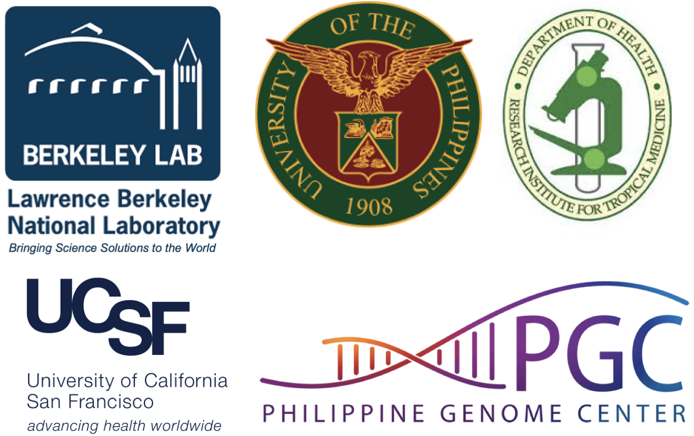

---------------------------------------------------------------------------------------------------------------------
Welcome to Bioinformatics Workshop for *M. tuberculosis* genomics and phylogenomics at The Philippine Genome Center
---------------------------------------------------------------------------------------------------------------------
This workshop is co-organized by `Berkeley Lab Ecology Department <https://eesa.lbl.gov/departments/ecology>`_, `UCSF Division of Pulmonary, Critical Care, Allergy and Sleep Medicine <https://pulmonary.ucsf.edu/>`_, and `The Philippine Genome Center (PGC) <https://pgc.up.edu.ph/>`_.

^^^^^^^^^
Overview
^^^^^^^^^
This four day bioinformatics workshop is intended to open doors to applying bioinformatics for microbial genomics and phylogenomics, with a specific focus on `M. tuberculosis`. The overarching goal is to drive  engagement with data analysis by increasing the reliability and quality of data interpretation regarding microbial genomics. The workshop is organized as a mixture of lectures and hands-on practicals.

::::::::::
Instructor
::::::::::
`Dr. Ulas Karaoz <https://eesa.lbl.gov/profiles/ulas-karaoz/>`_ (Berkeley Lab)

::::::::::
Keynote
::::::::::
`Midori Kato-Maeda, MD <https://globalprojects.ucsf.edu/investigator/midori-kato-maeda-md>`_ (UCSF): Genomics to improve the diagnosis of drug resistant tuberculosis

^^^^^^^^^^^^^^^^^^
Workshop Agenda
^^^^^^^^^^^^^^^^^^
.. toctree::
	:maxdepth: 1

	agenda

^^^^^^^^^^^^^^^^^^^^^^^^^^^
Workshop Computer Labs
^^^^^^^^^^^^^^^^^^^^^^^^^^^
.. toctree::
	:maxdepth: 1

	material/day1/index
	material/day2/index
	material/day3/index
	material/day4/index
	material/day5/index

