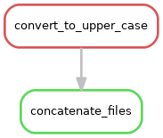

========================================================================================================
Building Bioinformatics Pipelines with `Snakemake <https://snakemake.readthedocs.io/en/stable/>`_
========================================================================================================

.. _documentation: https://snakemake.readthedocs.io/en/stable/#
.. _tutorial: https://snakemake.readthedocs.io/en/stable/tutorial/tutorial.html#tutorial
.. _stackoverflow: https://stackoverflow.com/questions/tagged/snakemake
.. _Googlegroups: https://groups.google.com/forum/#!forum/snakemake
.. _SublimeText: https://www.sublimetext.com/

A workflow management system (WMS) is a piece of software that sets up, performs and monitors a defined sequence of computational tasks (i.e. "a workflow"). ``Snakemake`` is a WMS that was developed in the bioinformatics community, and as such it has some features that make it particularly well suited for creating reproducible and scalable data analyses.

* The language you use to formulate your workflows is based on Python, which is a language with strong standing in academia. However, users are not required to know how to code in Python to work efficiently with ``Snakemake``.
* Workflows can easily be scaled from your desktop to server, cluster, grid or cloud environments. This makes it possible to develop a workflow on your laptop, maybe using only a small subset of your data, and then run the real analysis on a cluster.
* ``Snakemake`` has several features for defining the environment which each task is carried out in. This is important in bioinformatics, where workflows often involve running a large number of small third-party tools.
* ``Snakemake`` is primarily intended to work on _files_ (rather than for example streams, reading/writing from databases or passing variables in memory). This fits well with many fields of bioinformatics, notably next-generation sequencing, that often involve computationally expensive operations on large files. It's also a good fit for a scientific research setting, where the exact specifications of the final workflow aren't always known at the beginning of a project.
* Lastly, a WMS is a very important tool for making your analyses reproducible. By keeping track of when each file was generated, and by which operation, it is possible to ensure that there is a consistent "paper trail" from raw data to final results. Snakemake also has features which allow you to package and distribute the workflow, and any files it involves, once it's done.


The basics
----------
Activating ``snakemake`` environment within the VM
^^^^^^^^^^^^^^^^^^^^^^^^^^^^^^^^^^^^^^^^^^^^^^^^^^
In the tutorial virtual machine, ``snakemake`` is installed within a ``python3.5`` environment. Activate the environment as follows:
::

 source activate snakemake
 # check is snakemake is available
 snakemake -h

Create a directory to hold our work:
::
 
 mkdir -p ~/mtb_genomics_workshop/snakemake/example
 cd ~/mtb_genomics_workshop/snakemake/example

In this part of the tutorial we will create a very simple workflow from scratch, in order to show the fundamentals of how ``Snakemake`` works. The workflow will take two files as inputs, `a.txt` and `b.txt`, and the purpose is to convert the text in the files to upper case and then to concatenate them.

Run the following shell commands. The first one will make an empty file named `Snakefile`, which will later contain our example workflow. The second and third commands generate two files containing some arbitrary text.
::
 touch Snakefile
 echo "This is a.txt" > a.txt
 echo "This is b.txt" > b.txt


Then open `Snakefile` in a text editor. You can use SublimeText_, which you can invoke from command line with ``subl``:
::
 
 subl Snakefile

Rules
^^^^^
A ``Snakemake`` workflow is based on rules which take some file(s) as input, performs some type of operation on them, and generate some file(s) as outputs. Here is a very simple rule that takes `a.txt` as an input and produces `a.upper.txt` as an output. Copy this rule to your `Snakefile` and save it.


.. code-block:: python

 rule convert_to_upper_case:
    input:
        "a.txt"
    output:
        "a.upper.txt"
    shell:
        tr [a-z] [A-Z] < {input} > {output}

.. important::
    Indentation is important in Snakefiles, so make sure that you have the correct number of spaces before `input`/`output`/`shell` and their respective subsections. The number of spaces per level doesn't matter as long as you're consistent. Here we use four, but you could just as well use two for a more compact look. Don't use tabs (unless your editor automatically converts them to spaces).

* A rule has a name, here it's `convert_to_upper_case`. Make an effort to name your rules in a way that makes it easy to understand. The purpose of the rule, as rule names, are one of the main ways to interact with the workflow.
* The `shell` section contains the shell commands that will convert the text in the input file to upper case and send it to the output file. In the shell command string, we can refer to elements of the rule via curly brackets. Here, we refer to the output file by specifying `{output}` and to the input file by specifying `{input}`. This particular command can be read like "send the contents of `a.txt` to the program `tr`, which will convert all characters in the set [a-z] to the corresponding character in the set [A-Z], and then send the output to `a.upper.txt`".

Now let's run our first ``Snakemake`` workflow. When a workflow is executed ``Snakemake`` tries to generate a set of target files. Target files can be specified via the command line (or, as you will see later, in several other ways). Here we ask ``Snakemake`` to make the file `a.upper.txt`. It's good practice to first run with the flag `--dryrun`(or `-n`), which will show what Snakemake plans to do without actually running anything. You can also use the flag `--printshellcmds` (or `-p`, for showing the shell commands that it will execute, and the flag `--reason` (or `-r` for showing the reason for running a specific rule. `snakemake --help` will show you all available flags.

Do a dry-run:

::

 snakemake --dryrun --reason --printshellcmds a.upper.txt

::

 Building DAG of jobs...
 Job counts:
    count   jobs
    1       convert_to_upper_case
    1

 rule convert_to_upper_case:
    input: a.txt
    output: a.upper.txt
    jobid: 0
    reason: Missing output files: a.upper.txt

 tr [a-z] [A-Z] < a.txt > a.upper.txt
 Job counts:
    count   jobs
    1       convert_to_upper_case
    1

You can see that ``Snakemake`` plans to run 1 job: the rule `convert_to_upper_case` with `a.txt` as input and `a.upper.txt` as output. The reason for doing this is that it's missing the file `a.upper.txt`.

Now execute the workflow without the `--dryrun` flag and check that the contents of `a.upper.txt` is as expected. Then try running the same command again. What do you see? It turns out that Snakemake only reruns jobs if **one of the input files is newer than one of the output files, or if one of the input files will be updated by another job**. This is how Snakemake ensures that everything in the workflow is up to date.

Wildcards
^^^^^^^^^
We are going to next introduce the concept of ``wildcards`` in ``snakemake``. What if we ask Snakemake to generate the file b.upper.txt?

::

 $ snakemake --dryrun --reason --printshellcmds b.upper.txt
 Building DAG of jobs...
 MissingRuleException:
 No rule to produce b.upper.txt (if you use input functions make sure that they don't raise unexpected exceptions).

That didn't work. We could copy the rule to make a similar one for `b.txt`, but that would be a bit cumbersome. Here is where named wildcards come in; one of the most powerful features of ``Snakemake``. Simply change the input from `input: "a.txt"` to `input: "{some_name}.txt"` and the output to `output: "{some_name}.upper.txt"`.

Your updated `Snakefile` should look as follows:
::
 
 rule convert_to_upper_case:
    input:
        "{some_name}.txt"
    output: 
        "{some_name}.upper.txt"
    shell:
        "tr [a-z] [A-Z] < {input} > {output}"

Now try asking for `b.upper.txt` again:

::

 $ snakemake b.upper.txt
 Building DAG of jobs...
 Using shell: /usr/bin/bash
 Provided cores: 1
 Rules claiming more threads will be scaled down.
 Job counts:
    count   jobs
    1       convert_to_upper_case
    1

 rule convert_to_upper_case:
    input: b.txt
    output: b.upper.txt
    jobid: 0
    wildcards: some_name=b
 
 Finished job 0.
 1 of 1 steps (100%) done
 Complete log: /home/mtb_upm/mtb_genomics_workshop/snakemake/example/.snakemake/log/2018-07-05T134652.700927.snakemake.log


What happens here is that ``Snakemake`` looks at all the rules it has available (actually only one in this case) and tries to assign values to all wildcards so that the targeted files can be generated. In this case it was quite simple, you can see that it says that `wildcards: some_name=b`, but for large workflows and multiple wildcards it can get much more complex. Named wildcards is what enables a workflow (or single rules) to be efficiently generalized and reused between projects or shared between people and make scaling up computational workflows feasible.

It seems we have the first part of our workflow working, now it's time to make the second rule for concatenating the outputs from `convert_to_upper_case`. The rule structure will be similar; the only difference is that here we have two inputs instead of one. This can be expressed in two ways, either with named inputs like this:

.. code-block:: python

 input:
    firstFile="...",
    secondFile="..."
 shell:
    some_function {input.firstFile} {input.secondFile}

Or with indices like this:

.. code-block:: python

 input:
    "...",
    "..."
 shell:
    some_function {input[0]} {input[1]}

.. important::
     If you have multiple inputs or outputs they need to be delimited with a comma (as seen above). This is a very common mistake when writing Snakemake workflows. The parser will complain, but sometimes the error message can be difficult to interpret.

   
Now try to construct this rule yourself and name it `concatenate_a_and_b`. The syntax for concatenating two files in ``Bash`` is `cat first_file second_file > output_file`. Call the output `c.txt`. Run the workflow in ``Snakemake`` and validate that the output looks as expected.

Wouldn't it be nice if our workflow could be used for *any* files, not just `a.txt` and `b.txt`? We can achieve this by using named wildcards (or in other ways as we will discuss later). As we've mentioned, ``Snakemake`` looks at all the rules it has available and tries to assign values to all wildcards so that the targeted files can be generated. We therefore have to name the output file in a way so that it also contains information about which input files it should be based on. Try to figure out how to do this yourself.

Rename the rule to `concatenate_files` to reflect its new more general use.

.. code-block:: python

    rule concatenate_files:
        input:
            "{first}.upper.txt",
            "{second}.upper.txt"
        output:
            "{first}_{second}.txt"
        shell:
            "cat {input[0]} {input[1]} > {output}""

We can now control which input files to use by the name of the file we ask ``Snakemake`` to generate.

::

 $ snakemake a_b.txt
 Building DAG of jobs...
 Using shell: /usr/bin/bash
 Provided cores: 1
 Rules claiming more threads will be scaled down.
 Job counts:
         count   jobs
         1       concatenate_files
         1       convert_to_upper_case
         2
 
 rule convert_to_upper_case:
     input: a.txt
     output: a.upper.txt
     jobid: 2
     wildcards: some_name=a
 
 Finished job 2.
 1 of 2 steps (50%) done
 
 rule concatenate_files:
     input: a.upper.txt, b.upper.txt
     output: a_b.txt
     jobid: 0
     wildcards: second=b, first=a
 
 Finished job 0.
 2 of 2 steps (100%) done
 Complete log: /home/mtb_upm/mtb_genomics_workshop/snakemake/example/.snakemake/log/2018-07-05T135145.499632.snakemake.log


What we have learned so far:
* How a simple ``Snakemake`` rule looks
* How to define target files when executing a workflow
* How to use named wildcards for writing generic and flexible rules.

.. tip::
    You can name a file whatever you want in a Snakemake workflow, but you will find that everything makes much more sense if the filename reflects the file's path through the workflow, e.g. `sample_a.trimmed.deduplicated.sorted.bam`.

Visualization, logging and workflow management
^^^^^^^^^^^^^^^^^^^^^^^^^^^^^^^^^^^^^^^^^^^^^^
What we've done so far could have been quite easily  done in a simple shell script that takes the input files as parameters. Let's now take a look at some of the features where ``Snakemake`` really adds value compared to a more straightforward approach. One such feature is the possibility to visualize your workflow.

Snakemake can generate two types of graphs:

1. rules graph that shows how the rules are connected
2. jobs graph that shows how the jobs (i.e. an execution of a rule with some given inputs/outputs/settings) are connected.
     
**Rule graph**: First we look at the rule graph. The following command will generate a rule graph in the dot language and pipe it to the program ``dot``, which in turn will save a visualization of the graph as a png file (if you're having troubles displaying png files you could use svg or jpg instead).

::

 snakemake --rulegraph a_b.txt | dot -Tpng > rulegraph.png




All the graph says is that the output from the rule `convert_to_upper_case` will be used as input to the rule `concatenate_files`. For a more typical bioinformatics project it can look something like this:

.. image:: rulegraph_complex.png

**Job graph**: The second type of graph is based on the jobs, and looks like this for our little workflow (use `--dag` instead of `--rulegraph`).

::

 snakemake --dag a_b.txt | dot -Tpng > jobgraph.png

.. image:: jobgraph.png

The main difference here is that now each node is a job instead of a rule. You can see that the wildcards used in each job are also displayed. Another difference is the dotted lines around the nodes. A dotted line is Snakemake's way of indicating that this rule doesn't need to be rerun in order to generate `a_b.txt`. Validate this by running `snakemake -n -r a_b.txt` and it should say that there is nothing to be done.

We've discussed before that one of the main purposes of using a WMS is that it automatically makes sure that everything is up to date. This is done by recursively checking that outputs are always newer than inputs for all the rules involved in the generation of your target files.

Now try to change the contents of `a.txt` to some other text and save it. What do you think will happen if you run `snakemake -n -r a_b.txt` again?

::

 $ snakemake -n -r a_b.txt

    rule convert_to_upper_case:
        input: a.txt
        output: a.upper.txt
        jobid: 2
        reason: Updated input files: a.txt
        wildcards: some_name=a


    rule concatenate_files:
        input: a.upper.txt, b.upper.txt
        output: a_b.txt
        jobid: 0
        reason: Input files updated by another job: a.upper.txt
        wildcards: first=a, second=b

    Job counts:
            count   jobs
            1       concatenate_files
            1       convert_to_upper_case
            2
    ```

Also generate the job graph and compare to the one generated above. What's the difference?

Now rerun without `-n` and validate that `a_b.txt` contains the new text. Note that ``Snakemake`` doesn't look at the contents of files when trying to determine what has changed, only at the timestamp for when they were last modified.

We've seen that ``Snakemake`` keeps track of if files in the workflow have changed, and automatically makes sure that any results depending on such files are regenerated. What about if the rules themselves are changed? It turns out that there are multiple ways to do this, but the most straightforward is to manually specify that you want to rerun a rule (and thereby also all the steps between that rule and your target). Let's say that we want to modify the rule `concatenate_files` to also include which files were concatenated.

.. code-block:: python

 rule concatenate_files:
    input:
        "{first}.upper.txt",
        "{second}.upper.txt"
    output:
        "{first}_{second}.txt"
    shell:
        "echo 'Concatenating {input}' | cat - {input[0]} {input[1]} > {output}""


If you now run the workflow as before you should get "Nothing to be done", because no files involved in the workflow have been changed. Instead we have to force Snakemake to rerun the rule by using the `-R`flag. Let's try a dry-run.

::
 
 snakemake a_b.txt -r -n -R concatenate_files


Note that the reason for the job is now "Forced execution". You can target files as well as rules, so you would get the same result with `-R a_b.txt`. Whenever you've made changes to a rule that will affect the output it's good practice to force re-execution like this. Still, there can be situations where you don't know if any rules have been changed. Maybe several people collaborate on the same workflow but are using it on different files for example. Snakemake keeps track of how all files were generated (when, by which rule, which version of the rule, and by which commands). You can export this information to a tab-delimited file like this:

::

 snakemake a_b.txt -D > summary.tsv

The contents of `summary.tsv` is shown in the table below (scroll to see the full table).


+----------------+--------------------------+-----------------------+-----------+---------------+-------------------------+---------------------------------------+-----------------------------+-----------+
| output_file    | date                     | rule                  | version   | log-file(s)   | input-file(s)           | shellcmd                              | status                      | plan      |
+================+==========================+=======================+===========+===============+=========================+=======================================+=============================+===========+
| -------------- | ------                   | ------                | --------- | ------------- | ----------------        | ----------                            | --------                    | ------    |
+----------------+--------------------------+-----------------------+-----------+---------------+-------------------------+---------------------------------------+-----------------------------+-----------+
| a_b.txt        | Thu Nov 16 12:03:11 2017 | concatenate_files     | -         |               | a.upper.txt,b.upper.txt | cat a.upper.txt b.upper.txt > a_b.txt | rule implementation changed | no update |
+----------------+--------------------------+-----------------------+-----------+---------------+-------------------------+---------------------------------------+-----------------------------+-----------+
| a.upper.txt    | Thu Nov 16 12:03:11 2017 | convert_to_upper_case | -         |               | a.txt                   | tr [a-z] [A-Z] < a.txt > a.upper.txt  | ok                          | no update |
+----------------+--------------------------+-----------------------+-----------+---------------+-------------------------+---------------------------------------+-----------------------------+-----------+
| b.upper.txt    | Thu Nov 16 12:03:11 2017 | convert_to_upper_case | -         |               | b.txt                   | tr [a-z] [A-Z] < b.txt > b.upper.txt  | ok                          | no update |
+----------------+--------------------------+-----------------------+-----------+---------------+-------------------------+---------------------------------------+-----------------------------+-----------+


You can see in the second last column that the rule implementation for a_b.txt has changed. The last column shows if Snakemake plans to regenerate the files when it's next executed. None of the files will be regenerated because Snakemake doesn't regenerate files by default if the rule implementation changes. From a reproducibility perspective maybe it would be better if this was done automatically, but it would be very computationally expensive and cumbersome if you had to rerun your whole workflow every time you fix a spelling mistake in a comment somewhere. So, it's up to us to look at the summary table and rerun things as needed. You can get a list of the files for which the rule implementation has changed, and then force Snakemake to regenerate these files with the `-R` flag.

::
 
 snakemake a_b.txt -R $(snakemake a_b.txt --list-code-changes)

There are a number of these `--list-xxx-changes` flags that can help you keep track of your workflow. You can list all options with `snakemake --help`. Run with the `-D` flag again to make sure that the summary table now looks like expected.

You might wonder where Snakemake keeps track of all these things? It stores all information in a hidden subdirectory called `.snakemake`. This is convenient since it's easy to delete if you don't need it anymore and everything is contained in the project directory.

By now you should be familiar with the basic functionality of Snakemake, and you can build advanced workflows with only the features we have discussed here. There's a lot we haven't covered though, in particular when it comes to making your workflow more reusable. In the following section we will start with a workflow for calling variants.

We've learned:

* How to use `--dag` and `--rulegraph` for visualizing the job and rule graphs, respectively.
* How to force Snakemake to rerun relevant parts of the workflow after there have been changes.
* How logging in Snakemake works.


**Reference**: Koster, J. and Rahmann, S. (2012). Snakemake–a scalable bioinformatics workflow engine. Bioinformatics, 28(19), 2520–2522.

**Resources**:

* The ``Snakemake`` documentation_
* Here is the *official* tutorial_
* Further questions? Check out stack overflow_.
* There is a ``snakemake`` Googlegroups_.

**Credit**: `NBIS Reproducible research course 
<https://nbis-reproducible-research.readthedocs.io/en/latest/snakemake>`_.
